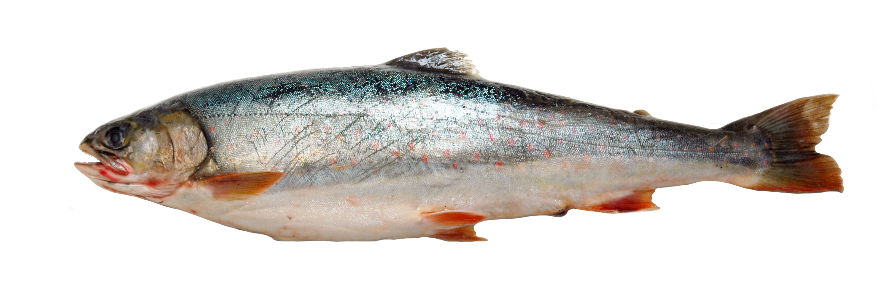

<div align="center">



## 🐟 Fish 🐟
Fish is a [Paper](https://github.com/PaperMC/Paper)/[Pufferfish](https://github.com/pufferfish-gg/Pufferfish/) fork designed for **performance**.


</div>

> [!WARNING]
> This was a meme \
> Please don't use, I won't provide support

## License
All patches are licensed under the MIT license.

[](LICENSE)

See [PaperMC/Paper](https://github.com/PaperMC/Paper), and [PaperMC/Paperweight](https://github.com/PaperMC/paperweight) for the license of material used by this project.

## Building and setting up

#### Initial setup
First, <u>clone</u> this repository. Do not download it.

Then run the following command in the root directory:

```
./gradlew applyAllPatches
```

The project is now ready for use in your IDE.

#### Creating a patch

See [CONTRIBUTING.md](CONTRIBUTING.md).

#### Compiling

Use the command `./gradlew build` to build the API and server. Compiled JARs
will be placed under `fish-api/build/libs` and `fish-server/build/libs`.
**These JARs are not used to start a server.**

To compile a server-ready paperclip jar, run `./gradlew createMojmapBundlerJar`.
To install the `fish-api` and `fish` dependencies to your local Maven repo, run `./gradlew publishToMavenLocal`. The compiled paperclip jar will be in `fish-server/build/libs`.

# Credits:

1. PaperMC Team.
2. Pufferfish Host.
3. PurpurMC Team, for their paperweight project setup.
4. Winds-Studio, for their auto release script.
5. SparklyPower, for their Parallel World Ticking patch.
