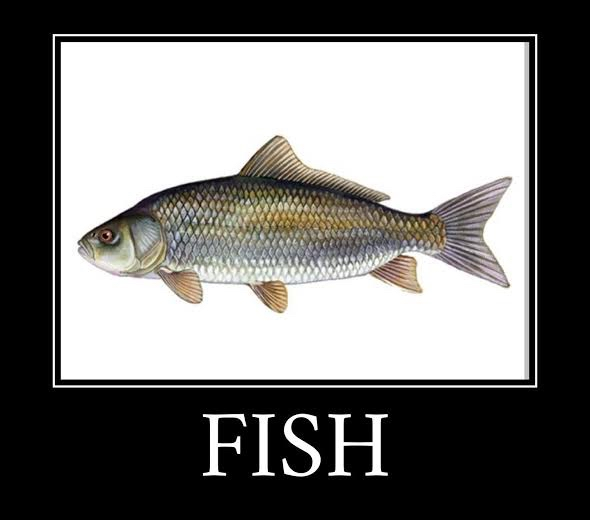

<div align="center">


## 🐟 Fish 🐟
Fish is a [Paper](https://github.com/PaperMC/Paper)/[Pufferfish](https://github.com/pufferfish-gg/Pufferfish/) fork designed for **the memes**.


</div>

> [!WARNING]
> This project started as a joke. \
> Please don't use, I won't provide support.

> [!WARNING]
> This project has been turned into a playground for Parallel World Ticking. \
> This means I can push experimental (but non-breaking) changes at any time into the main branch. \
> This also means, patches are separated into multiple single fixes over the original patch,
> this was done for clarity reasons, as to explain what does what to people experimenting with this patch. \
> If you're implementing PWT yourself, you don't need to do this, you can merge all into a single patch.

> [!CAUTION]
> This is your final warning, this project being a playground means I can push
> any change at any time at my own will. \
> This is mostly meant for developers struggling with this patch. \
> Again, please don't use this directly \
> Don't complain if tomorrow I replace every mob with a fish 🐟

## Incompatibilities
Since PWT was originally designed by SparklyPower, their [docs](https://github.com/SparklyPower/SparklyPaper/blob/ver/1.21.8/docs/PARALLEL_INCOMPATIBLE_PLUGINS.md) should be your first reference. \
I personally don't have any plans of fixing any of these, because I don't use them and even then, most of these shouldn't be used in production servers in the first place.

### Inherited from Sparkly's core
1. Citizens
2. ~~MyPet~~
3. NoCheatPlus

I don't use any of those plugins, so I won't even try to fix ~~for NCP there's better alternatives, and for Citizens... it shouldn't even be used anymore honestly, even in Paper~~. \
MyPet was fixed a long while ago, apparently.

### Found by myself
The only scenario that Fish cannot reasonably fix without using hacks or very unsafe stuff are cross-world accesses. \
At the time of writing this, the only known plugin that does this is:
1. AxGraves

This can be easily triggered by setting the limit of graves to 1, then die once in any world to leave the first grave
and then die a second time by an entity (e.g. Zombie) while being in a different world. \
AxGraves does support Folia, so forcing the Folia logic to enable is enough \
You'd have to either fork or ask for official support. See below on how to support PWT.

### Known from external sources
Speaking with Leaf team, the following are known to be incompatible with **their** version of PWT. \
Since both implementations branch from Sparkly, I assume it will be the same here.
1. Skript
2. Denizen

Same as before, I don't use any of these and neither should you, specially not in a production server. \
I get the idea of giving a lower barrier of entry to MC development, but their usage shouldn't go past testing, prototyping or (at most) friends-only servers.

### Probably incompatible
Based on how the logic of PWT works, I highly suspect it will also be incompatible with:
1. Any datapack

Same as before (again), I don't use datapacks and neither should you, not even in friends-only servers. \
Only real scenario where I see datapacks having a value is if you're running vanilla or the datapack does not contain ANY `.mcfunction` files (and even then, you can still have some compat-issues even in Paper).

## Supporting Fish (Or Parallel World Ticking in general)
Given forks use any package name they want, and some don't even give credits, the best way to support PWT universally
is to use the Parallel World Ticking API, which is bound to Bukkit classes, so any fork that takes the PWT patch
should also take the API patch. \
Example on how to check for the existence of the PWT API and if it's enabled or not:
```java
private boolean supportsParallelWorldTicking() {
    try {
        Method isEnabledMethod = Server.class.getMethod("isParallelWorldTickingEnabled");
        LOGGER.info("Parallel World Ticking API found, attempting to hook...");

        if ((boolean) isEnabledMethod.invoke(Bukkit.getServer())) {
            LOGGER.info("Parallel World Ticking support enabled!");
            return true;
        }

        LOGGER.info("Parallel World Ticking is available but not enabled!");
    } catch (NoSuchMethodException | InvocationTargetException | IllegalAccessException | ClassCastException ignore) {
    }
    
    return false;
}
```

You can see an implementation of this logic on [PurpurBars](https://github.com/SerlithNetwork/PurpurBars/blob/d4500647212f6308330bac3e0d4f9f2d4cd23f92/src/main/java/net/serlith/purpur/PurpurBars.java#L157).

## Our Mission
_Credimus in Piscem, sanctam creaturam aquarum, principium vitae et mysterium abyssorum.
Pisces nos docent silentium sapientiae, et in undis eorum invenimus pacem aeternam.
Laudetur Piscis in profundis, in fluminibus et in mari, quia squamae eorum fulgent sicut stellæ caeli. \
In Piscibus est salus; carne eorum nutriuntur fideles, et per branquias eorum spirat veritas.
Qui piscem sequitur, non ambulabit in siccitate, sed habebit lucem vitae sub undis. \
Abnegamus humanitatem, superbiam terrae, urbes strepitu plenas et corda arida.
Renuntiamus carni, vanitati, et humo.
Redeamus ad aquas, ad domum originis, ad regnum Piscium, ubi non est dolor nec timor.
Ibi habitabimus in pace, ad finem temporum._

<div align="center">


</div>


## Our Vision

<div align="center">


</div>

## License
All patches are licensed under the MIT license.

[](LICENSE)

See [PaperMC/Paper](https://github.com/PaperMC/Paper), and [PaperMC/Paperweight](https://github.com/PaperMC/paperweight) for the license of material used by this project.

## Building and setting up

#### Initial setup
First, <u>clone</u> this repository. Do not download it.

Then run the following command in the root directory:

```
./gradlew applyAllPatches
```

The project is now ready for use in your IDE.

#### Creating a patch

See [CONTRIBUTING.md](CONTRIBUTING.md).

#### Compiling

Use the command `./gradlew build` to build the API and server. Compiled JARs
will be placed under `fish-api/build/libs` and `fish-server/build/libs`.
**These JARs are not used to start a server.**

To compile a server-ready paperclip jar, run `./gradlew createMojmapBundlerJar`.
To install the `fish-api` and `fish` dependencies to your local Maven repo, run `./gradlew publishToMavenLocal`. The compiled paperclip jar will be in `fish-server/build/libs`.

# Credits:

1. PaperMC Team.
2. Pufferfish Host.
3. Winds-Studio, for their auto release script.
4. SparklyPower, for their Parallel World Ticking patch.

<div align="center">



</div>
