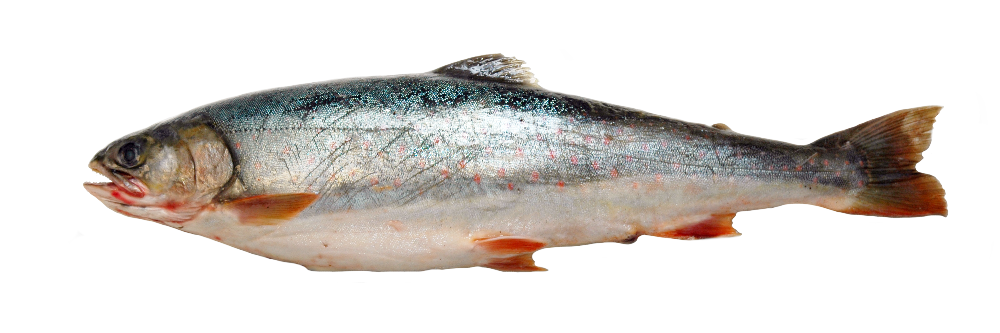
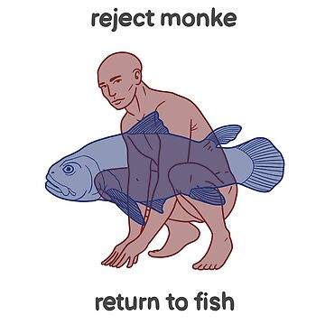

<div align="center">



## 🐟 Fish 🐟
Fish is a [Paper](https://github.com/PaperMC/Paper)/[Pufferfish](https://github.com/pufferfish-gg/Pufferfish/) fork designed for **the memes**.


</div>

> [!WARNING]
> This was a meme \
> Please don't use, I won't provide support

> [!WARNING]
> This meme has been turned into a playground for PWT \
> Stuff here _might be_ highly unstable \
> Again, please don't use \
> Don't complain if tomorrow I replace every mob with a fish 🐟

## Incompatibilities
Since PWT was originally designed by SparklyPower, their [docs](https://github.com/SparklyPower/SparklyPaper/blob/ver/1.21.8/docs/PARALLEL_INCOMPATIBLE_PLUGINS.md) should be your first reference. \
I personally don't have any plans of fixing any of these, both because I don't use them and even then, most of these should be used in production servers.

### Inherited from Sparkly's core
1. Citizens
2. MyPet
3. NoCheatPlus

I don't use any of those plugins, so I won't even try to fix ~~for NPC there's better alternatives, and for Citizens... it shouldn't even be used anymore honestly, even in Paper~~. \
MyPet you're fine, but sadly I don't use you, so I won't fix it for you :(

### Known from external sources
Speaking with Leaf team, the following are known to be incompatible with **their** version of PWT. \
Since both implementations branch from Sparkly, I assume it will be the same here.
1. Skript
2. Denizen

Same as before, I don't use any of these and neither should you, specially not in a production server. \
I get the idea of giving a lower barrier of entry to MC development, but their usage shouldn't go past testing or friends-only-servers.

### Probably incompatible
Based on how the logic of PWT works, I highly suspect it will also be incompatible with:
1. Any datapack

Same as before (again), I don't use datapacks and neither should you, not even in friends-only-servers. \
Only real scenario where I see datapacks having a value is if you're running vanilla or the datapack does not contain ANY `.mcfunction` files (and even then, you can still have some compat-issues even in Paper).

## Our Mission

<div align="center">



</div>


## Our Vision

<div align="center">


</div>

## License
All patches are licensed under the MIT license.

[](LICENSE)

See [PaperMC/Paper](https://github.com/PaperMC/Paper), and [PaperMC/Paperweight](https://github.com/PaperMC/paperweight) for the license of material used by this project.

## Building and setting up

#### Initial setup
First, <u>clone</u> this repository. Do not download it.

Then run the following command in the root directory:

```
./gradlew applyAllPatches
```

The project is now ready for use in your IDE.

#### Creating a patch

See [CONTRIBUTING.md](CONTRIBUTING.md).

#### Compiling

Use the command `./gradlew build` to build the API and server. Compiled JARs
will be placed under `fish-api/build/libs` and `fish-server/build/libs`.
**These JARs are not used to start a server.**

To compile a server-ready paperclip jar, run `./gradlew createMojmapBundlerJar`.
To install the `fish-api` and `fish` dependencies to your local Maven repo, run `./gradlew publishToMavenLocal`. The compiled paperclip jar will be in `fish-server/build/libs`.

# Credits:

1. PaperMC Team.
2. Pufferfish Host.
3. PurpurMC Team, for their paperweight project setup.
4. Winds-Studio, for their auto release script.
5. SparklyPower, for their Parallel World Ticking patch.
