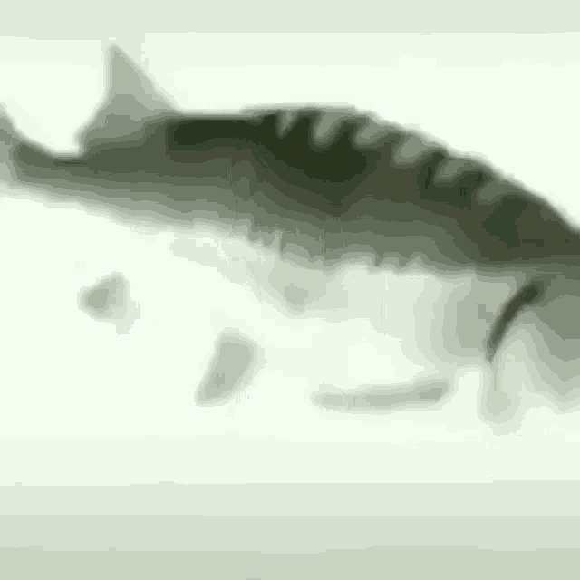
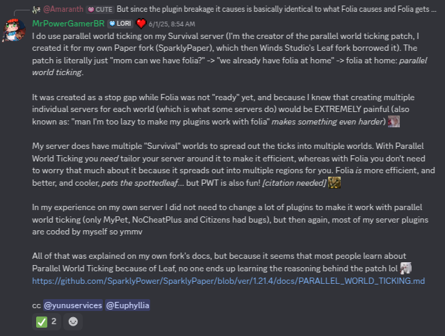
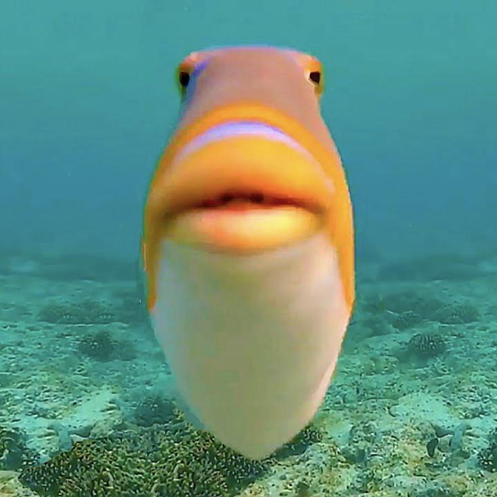

# Congratulations! 🐟

If you're reading this, means you actually care about what you're using. \
Here, have a spinning fish.

# Now, what is this
TL;DR; This is my playground. \
This repository contains very experimental and unstable patches that I do not dare to just combine into my fork.

## Today fish's flavour is... Parallel World Ticking!

This patch was made for SparklyPower's Survival as a middle ground between Paper and Folia, which means plugin compatibility IS NOT guaranteed. \
To use PWT you have to understand the patch and design your whole server around it. \
It is NOT free performance, you can't just enable it and expect your server to be faster, or even worse, enable it in hardware that is not enough to run PWT. \
As mentioned by MrPowerGamerBR (creator of PWT):

## Designing your server

I'm not a dev guy, so just take the advice of MrPowerGamerBR about making (developing) most of your plugins with PWT in mind. \
Now, as for my advice...

If you're on any of these categories, PWT is NOT for you:
1. You only have the 3 basic worlds (overworld, nether and end)
2. Your server has less than 100 players
3. Your players hang around in a single world most of the time

People visit the end only once (to get elytras). \
And the nether is just a metro station. \
Players usually pick the first option to play, if you give them `Survival 1`, `Survival 2` and `Survival 3` they WILL go to `Survival 1` and barely even visit the others. \
Most players usually pick places with most people, so a player-count when picking a survival world will draw most players to that world.

So, what should I do? \
Have a single way to teleport to `Survival`, either via GUI, portals, commands, etc. \
And make that single way randomly choose between the multiple Survivals. \
Players should not be aware (yet) that they're playing on different worlds. \
You can obviously let them know somewhere in the spawn, since they will want to play with their friends at some point, but this "teleport hub" should be the second thing they see, the first one should be your _random teleporter_.

Now go, have fun designing your own survival experience.

## Drawbacks

The idea of Fish (besides the fish memes) was to add some extra level of plugin compatibility. \
This means more plugins will be compatible, but doesn't mean avery plugin will work. \
And even if a plugin does work, it doesn't guarantee it is fine.

To achieve this extra layer of compatibility I followed this approach:
1. CraftBukkit implementations for Bukkit's API (CraftWorld, CraftBlock) now schedule its async access to be run after the world is done ticking.
2. Applied some fixes that @Taiyou at Leaf took the time to find (entity portal teleport, redstone, villager poi)

The first point has some drawbacks:
1. If a plugin accesses these API functions async, the whole thread will wait until it's done
2. The async access is now forced to be run sync at the end of the thread, which means it will take a part of the world's tick
3. If a plugin abuses its accesses (constantly access those in a loop) there's a chance it will have every thread waiting
4. If a plugin abuses its accesses, all tasks will accumulate and most likely take a lot of the tick's time.
5. Schedule task = More allocations = More GC pauses 🐟 (it shouldn't be noticeable tbh)

General drawbacks:
1. Say bye-bye to `/spark profilar start`, from now own you HAVE to use at least `/spark profiler start --thread ^Fish Level.* --regex`
2. Async plugin that directly access NMS async will still be broken (none should, but who knows)

# Wow, you really read everything

Here, have this fish as a thank-you gift. \
I know I've said "when using these", "if you use this" a lot in here, but seriously, do not use this fork. \
I will add something very cursed at some point like replacing every mob with a fish 🐟 just because it's funny. \
If you want to use this PWT, please copy what you need from here (don't forget to credit the authors in the patch header) and use it somewhere else.

Even tho all the patches are PWT, I kept them separated to make it easier to know what each change does. \
I will personally keep four separate patches when I decide to merge this into my fork:
1. The "OG" (not really OG, since I modified the original implementation to fit my taste) PWT patch
2. The OG MSPT tracking
3. The fixes from Leaf
4. The fixes from Fish 🐟

